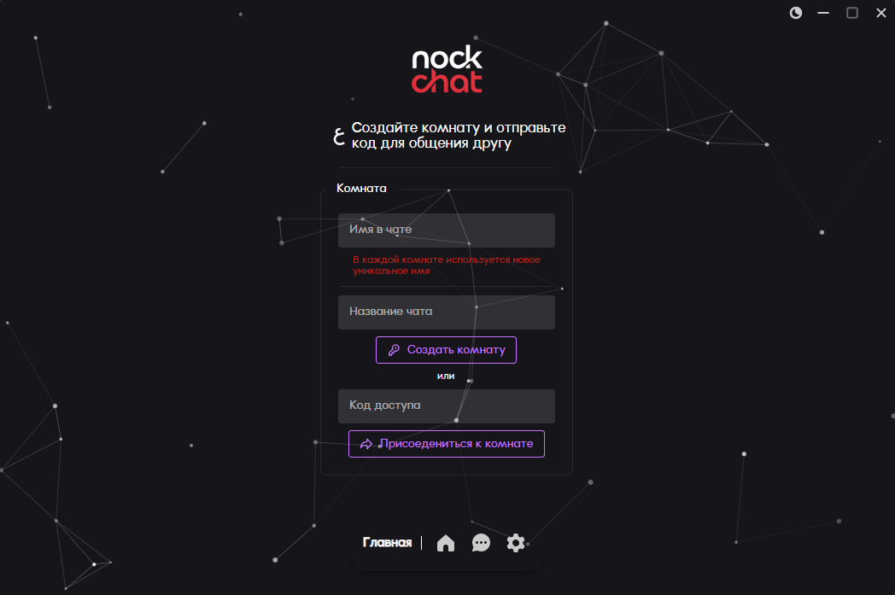
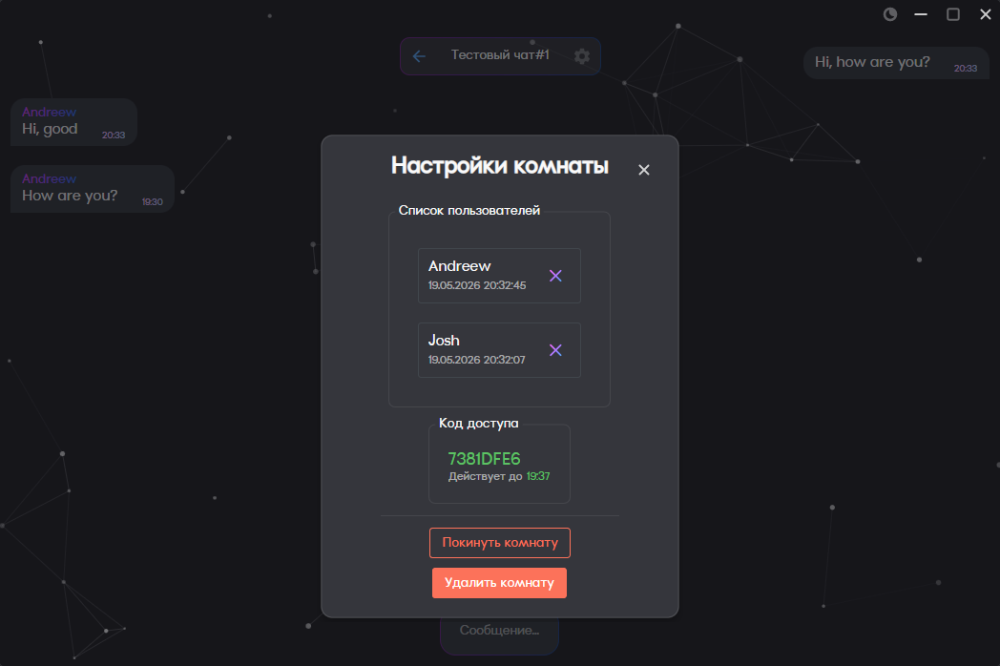
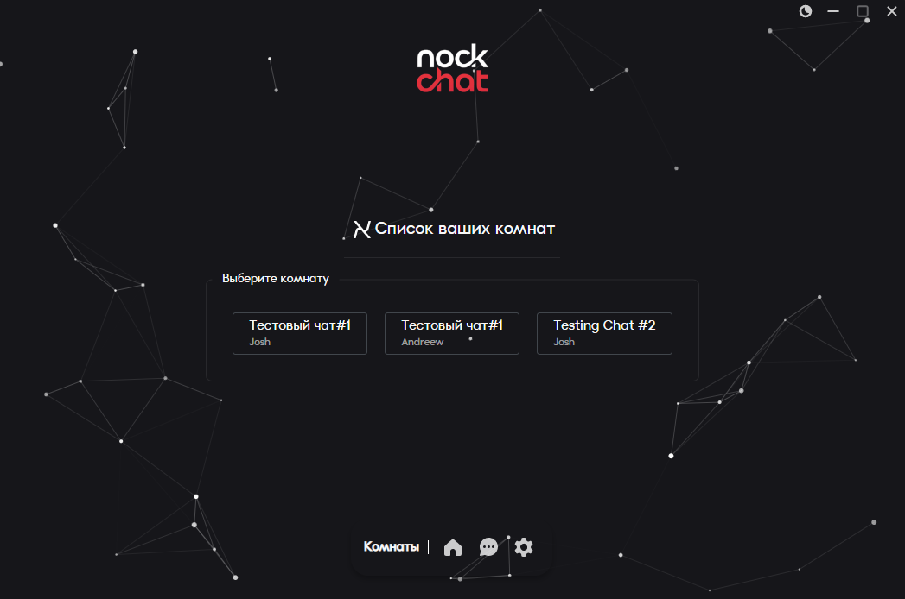

  

  ### Кроссплатформенный клиент на **`.NET`** (`Avalonia UI`)
  ### Серверная часть на **`ASP.NET Core Web API`**

---
Приложение работает по логике комнат, при входе или создании комнаты требуется **всегда** указывать новое имя пользователя, которое будет **уникально и использоваться только в рамках этой комнаты**.

### Главная страница

---
Для входа в существующию комнату используются **временные коды приглашения**, которые можно получать в настройках комнаты.

### Настройки комнаты

---
Посмотреть весь список доступных чатов можно на странице **"Список ваших комнат"**

### Список ваших комнат

## RoadMap
> Дальнейший план действий по приложению

- [ ] Реализовать шифрование сообщений
- [ ] Оптимизировать работу приложения на iOS
- [ ] Оптимизировать работу приложения на Android
- [ ] Добавить уведомления о новых сообщениях
- [ ] Добавить возможность исключать участников комнаты
